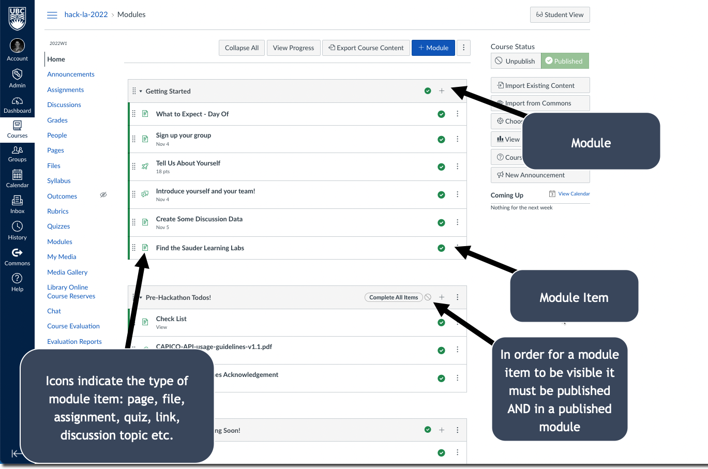
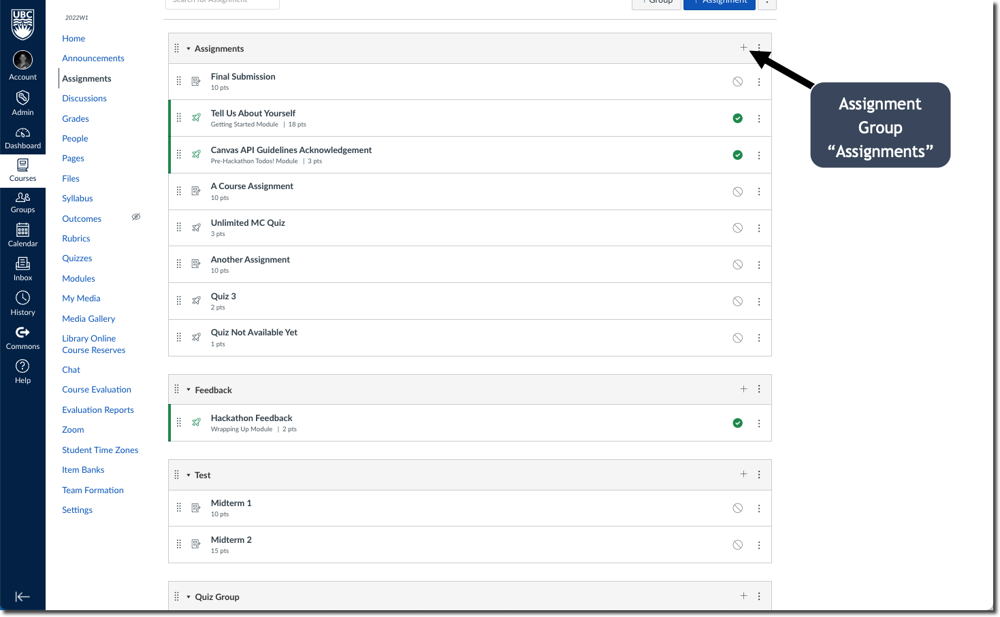
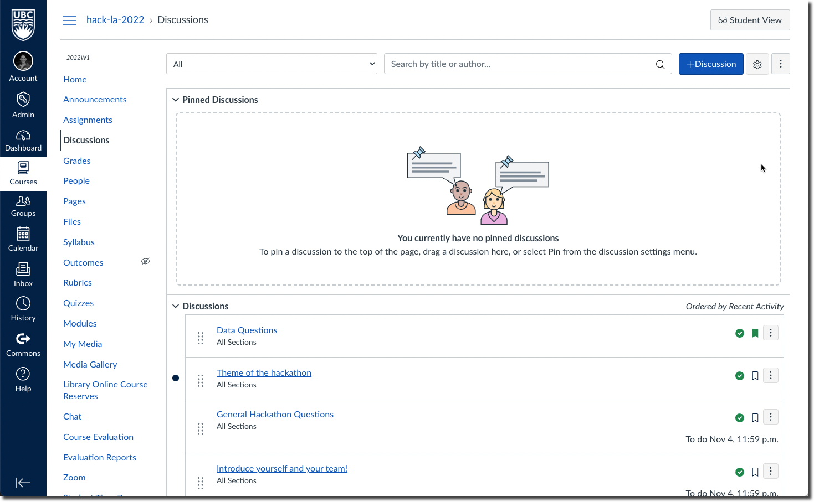
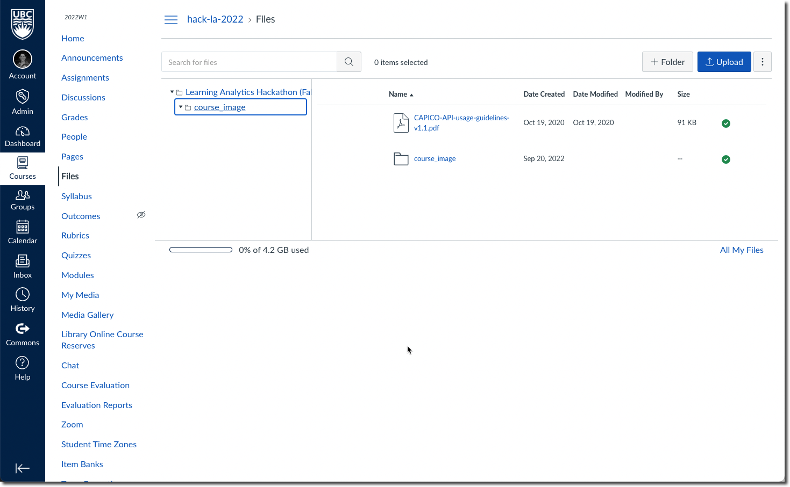
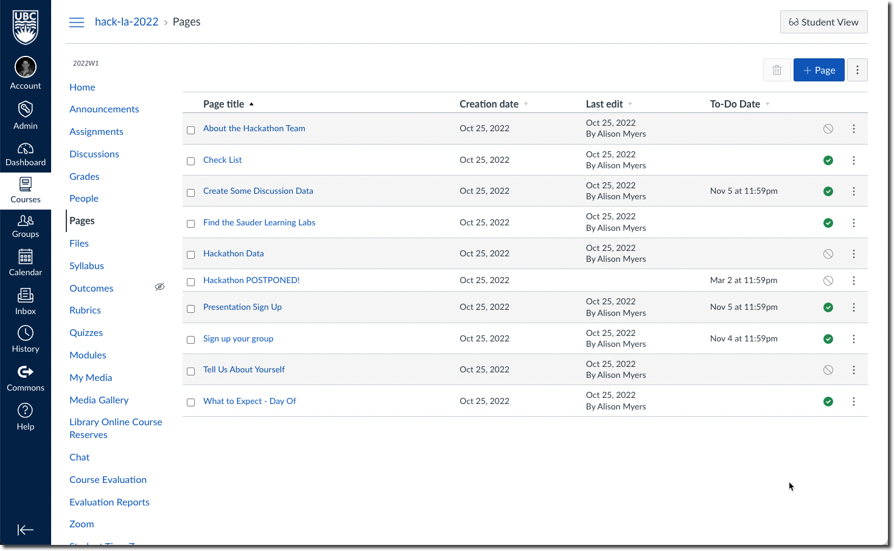

# Hackathon Data

1. **Navigation Events**: Student-level navigation events in a given Canvas course. This dataset has been simplified and anonymized for the purpose of this hackathon as described in the Field Descriptions below.
Original Navigation Events (not used in this hackathon) are in the following format: https://canvas.instructure.com/doc/api/file.data_service_caliper_navigation_events.html

2. **Additional**: this data was pulled using the Canvas API. Included here is the *Official Information* - which is the detailed API and data information from Canvas. We have also included *Field Descriptions* for each additional data source. The field descriptions indicates which fields from the API are kept, and provides more information about the data. Where necessary, notes are added to help understand this data more thoroughly.

## Navigation Events
> navigation_events.csv

Caliper events follow certain profiles depending on their type. In general, a Caliper Event described the relationship between an actor and an object, where the actor acts upon the object. In our case, the actor NavigatedTo an object, where the object is some part of the Canvas course.

> Image from [IMS Global](https://www.imsglobal.org/spec/caliper/v1p2#event)

More about the Caliper information model: https://www.imsglobal.org/spec/caliper/v1p2#the-information-model

[Navigation events](https://www.imsglobal.org/spec/caliper/v1p2#navigationevent) are a type of Caliper event. In the original data, Caliper events are in JSON format and each event includes a list of "data". In the transformed csv, each item in the data list is an "event". The field will contain the prefix event__ for each.

### Field Descriptions
- We have only included the fields included in the dataset, and partial definitions. You should find everything you need to know in the Caliper documentation.

 See:
 1. https://www.imsglobal.org/spec/caliper/v1p2#event

 2. https://www.imsglobal.org/spec/caliper/v1p2#navigationevent

> 🧐 Stuck on your hackathon idea? Help us build the data dictionary! Submit a pull request from a branch named `dictionary_update_{TEAMNAME}`. This shouldn't just by a replication of the Caliper dictionaries above - but should provide more meaningful Descriptions and Notes.

> 🧐 Stuck on your hackathon idea? Help us build the data dictionary! Submit a pull request from a branch named `dictionary_update_{TEAMNAME}`. This shouldn't just by a replication of the Caliper dictionaries above - but should provide more meaningful Descriptions and Notes.

Field | Description | Note
---------|---------|---------
id | 
type |
action |
event_time | The time the event occurred (UTC)
ed_app | empty in anonymized data
course_offering_id | 
session_id | 
statement_type |
statement_version |
object_id | This is the unique identifer for each object, and should relate to each event__object_extensions_asset_name. | This should act as your join key, where possible to the additional datasets for the anonymized data.
membership_role |
actor_id | For the anonymized data we use actor_id in replace of event__actor_extensions_user_did_id
event__object_type |
event__object_name |
event__object_extensions_asset_name |
event__object_extensions_asset_type |
event__object_extensions_asset_subtype | empty in anonymized data
event__object_extensions_entity_id | empty in anonymized datay
event__object_extensions_http_method |
event__referrer | empty in anonymized data
event__request_id | empty in anonymized data
event__request_url | empty in anonymized data
event__attachment_type | only in anonymized data, extracted attachment type if event__object_name is "attachment"

## Module Items
- File: additional/module_items.csv
- Official Information:  https://canvas.instructure.com/doc/api/modules.html (includes information on modules and module items)

In Canvas, content can be organized into Modules which contain module items. Module items can be pages, files, assignments, quizzes, discussion forums etc. Module items can be published/unpublished, if they are assignments they can have due dates, and if they are pages/files they can have to-do dates. Modules can be organized in any way, could have requirements and/or pre-requisites and may be published/unpublished.

### Field Descriptions

Field | Type | Description | Note
---------|----------|---------|---------

## Assignments
- File: additional/assignments.csv
- Official Information: https://canvas.instructure.com/doc/api/assignments.html

Assignments are any sort of assessible content in Canvas - this may include an Assignment, Quiz, or Graded Discussion. Assignments can be found in the Assignments navigation (when set to visible by the instructor), and/or included as a module item - this depends on the decisions of individual course instructors. Instructors can choose to organize Assignments in groups for organizational (as done in the example Assignments area below) and/or grading purposes (i.e. creates weighting for group of assignments).

> For the purposes of the hackathon, assume that all Assignments are

### Field Descriptions

Field | Type | Description | Note
---------|----------|---------|---------
 id | assignment_id | The assignment_id is a unique string of an assignment | The assignment_id has been anonymized for the purpose of the hackathon (it is typically an integer)
 due_at | datetime | The due date of the assignment
 unlock_at | datetime | The datetime of when to unlock the assignment (make it accessible to students) | If empty, there is no lock / unlock dates for this assignment
 lock_at | datetime | The datetime of when to lock the assignment (make it inaccessible to students) | If empty, there is no lock / unlock dates for this assignment
 points_possible | number | The total points available for grading in this assignment
 grading_type | string | How to assign grades to the assignment
 position | number | In a Canvas course instructors can organize assignments into groups - when doing so, the position indicates the assignment sort order within its group
 name | string | The assignment name
 submission_types | list | The possible assignment submission types
 has_submitted_submissions | boolean | Whether any submissions have been submitted for the given assignment
 workflow_state | string | The state of the assignment within the course | Typically published or unpublished
 published | boolean | The published state of a given assignment

## Discussion Topics
- File: additional/discussion_topics.csv
- Official Information: https://canvas.instructure.com/doc/api/discussion_topics.html

### Field Descriptions

Field | Type | Description | Note
---------|----------|---------|---------
id | string | The id of the discussion topic.
title | string | The title of the discussion topic
position | number |  The position order of discussion topics in the discussion forums
podcast_has_student_posts | boolean |
discussion_type | string | A discussion topic can allow threaded responses or single comments. Indicated by discussion_type
lock_at | datetime | The date to lock discussion (if provided)
allow_rating | boolean | Whether to allow student rating of posts
discussion_subentry_count | number | The number of responses to the discussion topic
podcast_url | url | If the discussion topic has an associated podcast feed, the url of the feed
read_state | string |
published | boolean | Whether the discussion topic is published
pinned | boolean | Discussion topics can be pinned to the top of the page by the instructor, if so will be TRUE
todo_date_date | datetime | If given a todo date in Canvas - the suggested datetime of completion

## Discussions
- File: additional/discussions.csv

### Field Descriptions

Field | Type | Description | Note
---------|----------|---------|---------
actor_id | string | The unique idenitifier of the user
membership_role | string | Indicates if the user is an instructor or a learner (student)
timestamp | datetime | The datetime that the discussion was posted
post_id | string | The unique id of the discussion post
parent_post_id | string | The unique id of the parent of the discussion post. The parent post could be a discussion topic or a reply to a discussion post.
discussion_topic_title | string | The title of the discussion topic
discussion_topic_message_length | integer | The character length of the topic
post_message_length | integer | The character length of the discussion post | Note that the messages are wrapped in HTML tags. For example: `"
Most foods I think of that I eat with ketchup, the ketchup is a bonus (grilled cheese, bonus ketchup). But, I think that mustard foods NEED the mustard (hotdog, needs mustard).  So, I'm team mustard.
"`
count_of_likes | float | The number of upvotes (likes) that a post received

## Files
- File: additional/files.csv
- Official Information: https://canvas.instructure.com/doc/api/files.html

Instructors can include files in their Canvas courses. These files can become module items, or remain in the "Files" area. Files are associated with individual courses. Files can be embedded in Canvas pages, images included in pages or in the course header are considered files.

### Field Descriptions

Field | Type | Description | Note
---------|----------|---------|---------
id | string | The string value of the file
filename_masked | string | The name of the file (masked for this purpose)
content-type | string | Indicates the kind of file
hidden | boolean | Whether the file is hidden from students
mime_class | string | The kind of file
media_entry_id | |
category | |

## Pages
- File: additional/pages.csv
- Official Information: https://canvas.instructure.com/doc/api/pages.html

Most Canvas content takes the form of pages (and files). Like other Canvas content, this can be found in the navigation Pages (when allowed by instructors) or included as a module item.

### Field Descriptions

Field | Type | Description | Note
---------|----------|---------|---------
id | string | The id of the page
title | string | The title of the page as appears in Canvas
page_url | string | The navigation url associated with the page. The full url would appear in the form of https://canvas.ubc.ca/COURSE_ID/page_url
published | boolean | Whether the page is published

## Enrollments
- File: additional/enrollments.csv
- Official Information: https://canvas.instructure.com/doc/api/enrollments.html

Enrollments are the people enrolled in the Course.

### Field Descriptions

Field | Type | Description | Note
---------|----------|---------|---------
user_id | string | The transformed string of the user | In the anonymized dataset takes the form of LEARNER_{number}
type | string | The type of enrollment - this dataset has been limited to StudentEnrollment and StudentViewEnrollment | StudentViewEnrollment is automatically created when an instructor chooses to preview as a student
last_activity_at | datetime | The datetime as determined by Canvas of the last activity in the course
last_attended_at | datetime | The datetime of the individual's last attendance
total_activity_time | number | The total activity time as calculated by Canvas (in seconds)

## Gradebook
> The Assignment gradebook from Canvas (as instructors would see it)

Weights:
Assignment 1 - 20%
Assignment 2 - 30%
Assignment 3 - 30%
Participation - 20%

### Field Descriptions

Field | Type | Description | Note
---------|----------|---------|---------